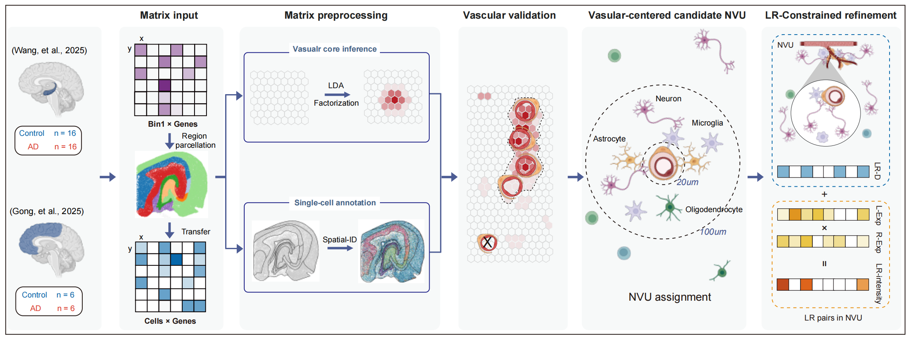

# NVU AD Spatial Transcriptomics

Code repository for the manuscript analyses of neurovascular unit (NVU)
remodeling in Alzheimer's disease using single-cell-resolution spatial
transcriptomics.

The notebooks are organized by manuscript figure and curated for public
release: outputs are cleared, exploratory scratch cells were removed, and each
notebook retains analyses that directly support the corresponding manuscript
figure panels. Local server paths were removed from the public code. Paths are
repository-relative by default, and `NVU_PROJECT_ROOT` can be set when running
notebooks from another working directory.

## Figure Code

| Manuscript figure | Main analysis | Code |
| --- | --- | --- |
| Figure 1 | Vascular-centered digital NVU reconstruction and vascular-field visualization | `notebooks/figure1_nvu_reconstruction.ipynb`; `scripts/figure1_vascular_ficture.py`; `docs/figures/figure1.png` |
| Figure 2 | AD-associated digital NVU abundance and cellular composition changes | `notebooks/figure2_ad_nvu_abundance_composition.ipynb` |
| Figure 3 | Hippocampal and cortical DEG, hdWGCNA, enrichment, and hub-gene network analyses | `notebooks/figure3_hippocampus_wgcna_up.ipynb`; `notebooks/figure3_hippocampus_wgcna_down.ipynb`; `notebooks/figure3_cortex_wgcna_up.ipynb`; `notebooks/figure3_cortex_wgcna_down.ipynb` |
| Figure 4 | Stereosite ligand-receptor communication landscapes | `notebooks/figure4_hippocampus_stereosite_allpairs.ipynb`; `notebooks/figure4_cortex_stereosite_allpairs.ipynb` |
| Figure 5 | Disease-associated astrocyte and microglial state analyses | `notebooks/figure5_disease_associated_glia.ipynb` |
| Figure 6 | Aβ-associated NVU remodeling, density, and gene-change analyses | `notebooks/figure6_abeta_nvu_gene_changes.ipynb`; `notebooks/figure6_abeta_nvu_integrated_changes.ipynb` |
| Figure 7 | Multi-scale GNN vulnerability modeling and interpretation | `scripts/figure7_model.py` for the training workflow; `notebooks/figure7_gnn_vulnerability_modeling.ipynb` for figure-panel plotting |
